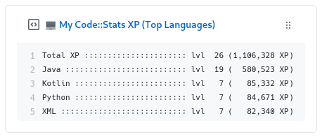

<p align='center'>
  
  <h3 align="center">codestats-box</h3>
  <p align="center">Update a pinned gist to contain your weekly Code::Stats stats</p>
</p>

---

> 📌✨ For more pinned-gist projects like this one, check out: https://github.com/matchai/awesome-pinned-gists

## 🎒 Prep Work

1. Create a new public GitHub Gist (https://gist.github.com/)
2. Create a token with the `gist` scope and copy it. (https://github.com/settings/tokens/new)
3. Copy the `API token`

## 🖥 Project Setup

1. Fork this repo
2. Go to your fork's `Settings` > `Secrets` > `Add a new secret` for each environment secret (below)

## 🤫 Environment Secrets

- **GH_TOKEN:** The GitHub token generated above.
- **GIST_ID:** The ID portion from your gist url `https://gist.github.com/<github-username>/`**`6d5f84419863089a167387da62dd7081`**. (Alternatively this can be put directly in `.github/workflows/codestats.yml` as it is public anyway.)
- **CODE_STATS_USERNAME:** Your [Code::Stats](https://codestats.net) username. (This can also be put directly in `.github/workflows/codestats.yml`)

## 🤓 Hacking

```bash
# setup
pipenv install --dev
# testing
pipenv run python codestats_box.py test <gist> <github-token> <user> <type>
```
